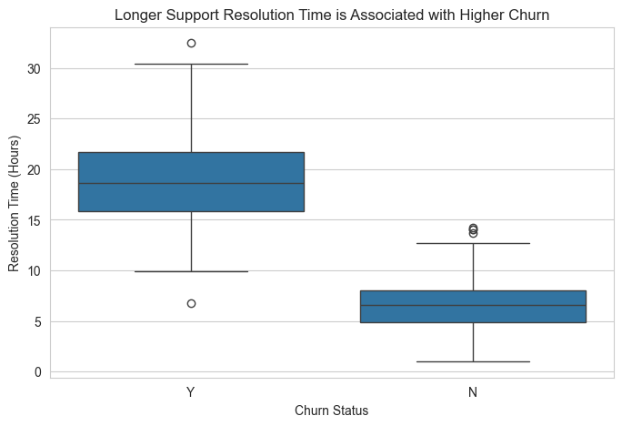
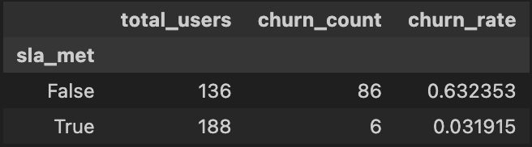
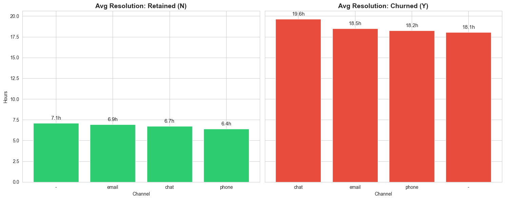
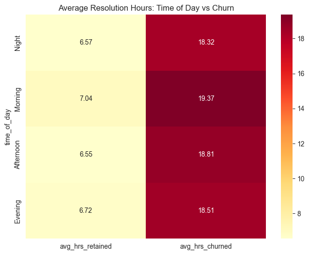
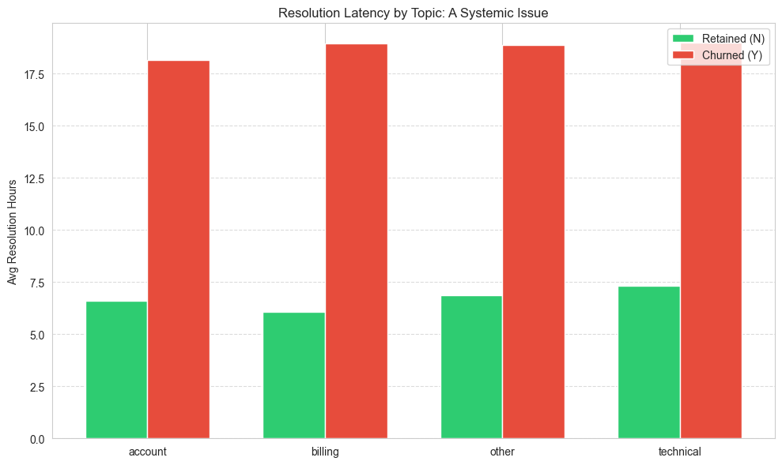
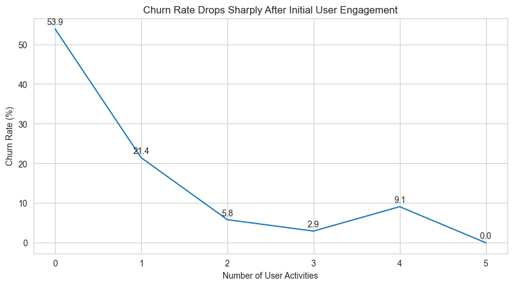
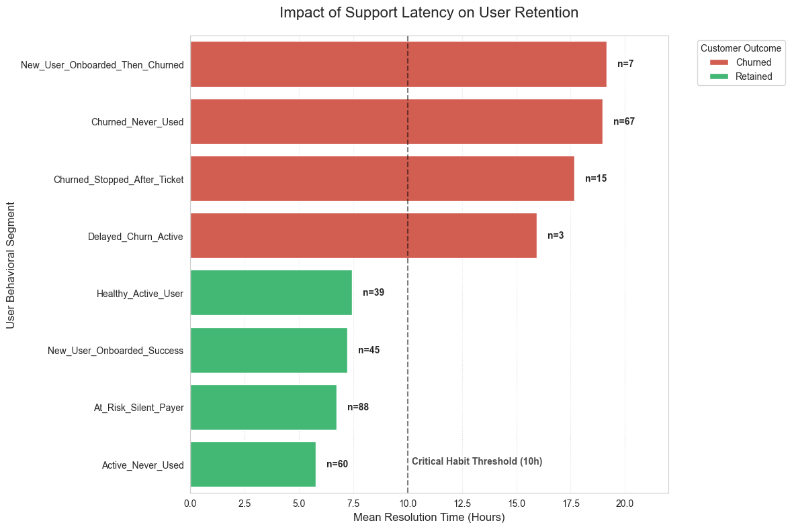
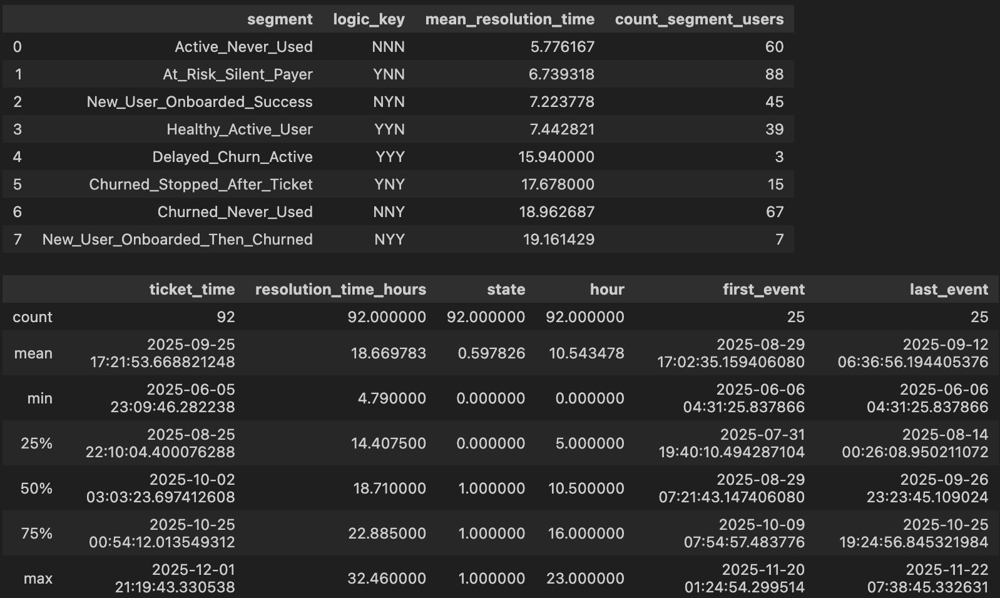
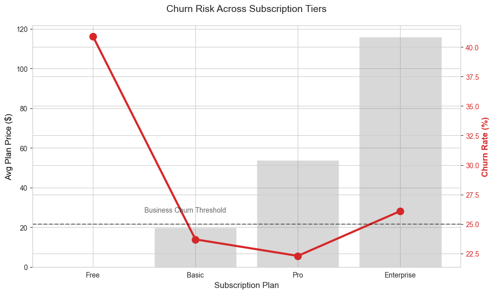
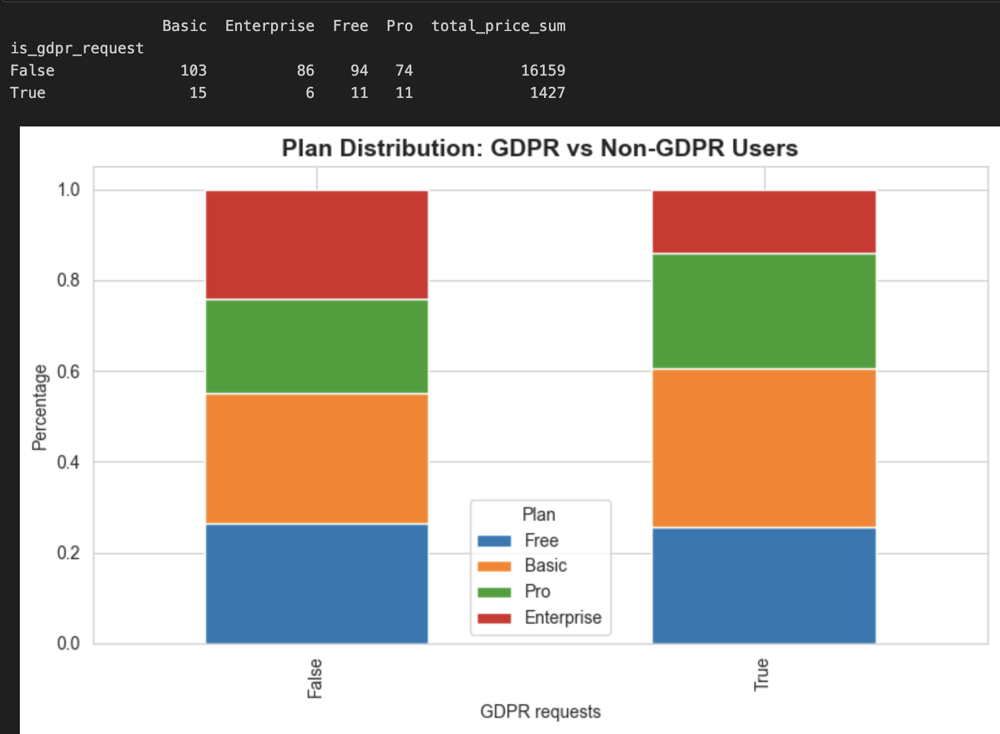

# Customer Churn Analysis for Fit.ly Tech 🏋️‍♂️

> **Strategic Question:** How do customer support delays and product engagement interact to drive churn, and where is the critical retention threshold?

This project analyzes customer churn by combining subscription data, support tickets, and user activity logs to identify the operational moments most strongly linked to customer loss.  
Rather than relying on broad averages, the analysis focuses on measurable thresholds that can improve retention and protect recurring revenue.

---

# 📌 Project Objective

The goal of this project is to uncover:

- Whether slow customer support increases churn  
- How product engagement influences retention  
- Which customer segments are most at risk  
- What actions Fit.ly can take to reduce churn immediately  

---

# 🗂️ Data Architecture

The analysis integrates three internal datasets:

## Account Info
- Subscription plan (Free → Enterprise)  
- Monthly value / plan price  
- Churn status  

## Customer Support
- Ticket topics  
- Support channels  
- Submission and resolution timestamps  

## User Activity
- Timestamped product events used to measure engagement before and after support interactions  

---

# 🛠️ Data Preparation & Validation

## Data Preparation
- Removed 43 GDPR deletion requests (~11% of users) to maintain compliance  
- Built behavioral segments based on activity before/after support interactions  
- Created SLA indicators using ticket resolution time thresholds  

## Validation Checks
- High resolution times (up to 32h) were reviewed and treated as valid poor experiences, not data errors  
- User activity volumes fell within expected ranges  
- All timestamps aligned with the June–December 2025 analysis period  
- Plan prices matched expected Free / Paid tier structure  

---

# 📊 Exploratory Analysis

# 1️⃣ Support Performance & Churn

## Support Latency Impact

  

**What it shows:** Comparison of ticket volume and resolution speed between retained and churned users.  

**Key Finding:** Ticket volume is nearly identical across groups, but churned users wait almost 3x longer for resolution.  

**Business Meaning:** Churn is driven by slow support response, not by users submitting more tickets.

---

## SLA Impact Analysis

  

**SLA Threshold Methodology:** The 10-hour threshold was derived from a natural inflection point in the data.

When analyzing resolution times across all users, the data revealed a **bimodal split**:
- Users with resolution ≤ 10 hours: **3.2% churn rate**  
- Users with resolution > 10 hours: **63.2% churn rate**  

This 20x difference indicates a natural behavioral boundary—not an arbitrary cutoff. The 10-hour mark represents the point where customer patience shifts from "delayed but acceptable" to "unacceptable."

**Definition:** Tickets were classified using this evidence-based 10-hour SLA threshold.

- **SLA Met:** Resolution ≤ 10h  
- **SLA Breached:** Resolution > 10h  

**Business Meaning:** Support speed acts as a binary retention trigger. Crossing the 10-hour mark sharply increases churn risk by 20x, suggesting that customers form a critical perception of service quality around this threshold.

---

## Operational Diagnostics

  

  

  

**Key Finding:** Resolution delays remain consistent across channels, ticket timing, and support topics.

**Business Meaning:** The issue appears systemic (workflow/process capacity), not channel-specific or schedule-specific.

---

# 2️⃣ Product Engagement & Retention

## Churn Rate by Engagement

  

**Key Finding:**
- 0 events → 53.9% churn  
- 2+ events → <6% churn  

**Business Meaning:** Early product engagement strongly protects against churn.

---

## The Retention Cliff

  

**Key Finding:** The strongest churn boundary appears near the 10-hour support delay mark.

**Business Meaning:** Fast support is especially important before users build product habits.

---

## The "Silent Crisis" (Low Engagement Despite Good Support)

  

**Key Finding:** The largest segment (YNN) receives fast support but still shows weak product usage.

**Business Meaning:** Some churn risk is driven by product activation, not support quality.

---

# 3️⃣ Pricing & Customer Segments

## Churn Rate by Plan

  

**Key Finding:**
- Free users show the highest churn rate (~41%)  
- Paid tiers retain users more effectively  

**Business Meaning:** Lower-commitment users are more sensitive to poor support experiences.

---

## GDPR User Review

  

**Key Finding:** GDPR deletion requests were concentrated in lower-tier plans and among users with slower support experiences.

**Business Meaning:** Privacy deletion requests may reflect final-stage churn behavior rather than isolated compliance behavior.

### Churn Rate: GDPR vs. Non-GDPR Users

| Segment | Users | Churned | Churn Rate |
|---|---|---|---|
| Non-GDPR users | 357 | 97 | **27.2%** |
| GDPR requestors | 43 | 17 | **39.5%** |

Users who submitted a data deletion request churned at a rate **45% higher** than the rest of the user base (39.5% vs 27.2%).

Breaking down GDPR users by churn outcome reveals the same support latency pattern seen across the broader dataset:

| Outcome | Avg Wait Time | Avg App Events |
|---|---|---|
| GDPR — Retained | 7.3h | 1.50 |
| GDPR — Churned | 19.1h | 0.29 |

**Insight:** Within the GDPR group, retained users received support well under the 10-hour SLA (7.3h), while churned users experienced an average wait of 19.1 hours—nearly triple that of retained peers. Their near-zero app activity (0.29 events) also indicates they had already disengaged from the product before filing the deletion request.

**Business Meaning:** The elevated churn rate among GDPR users is not driven by privacy concerns—it is driven by the same support latency failure seen across all churned users. The data deletion request is best interpreted as the final administrative step of a user who had already decided to leave. Addressing the 10-hour SLA breach would reduce churn risk in this segment to the same degree as the broader population.

---

# 📌 Key Insights

## ⭐ 1. Support Latency Is the Strongest Operational Churn Driver
Customers do not churn because they create more tickets—they churn because they wait too long for resolution.

## ⭐ 2. The 10-Hour SLA Is a Critical Retention Threshold
Crossing the 10-hour mark is strongly associated with churn risk.

## ⭐ 3. Product Engagement Creates a Retention Shield
Once users complete early product actions, churn drops sharply.

## ⭐ 4. Free Users Are the Most Vulnerable Segment
Users with low financial commitment are least tolerant of friction.

## ⭐ 5. Not All Churn Is a Support Problem
Some users receive strong support but fail to adopt the product, indicating onboarding gaps.

---

# 🚀 Strategic Recommendations

## 1. Move to SLA-Based Operations
Track **SLA Breach Rate** instead of average response time.  

**Target:** Reduce breach rate to <10%.

## 2. Prioritize New Users
Fast-track first tickets from new or inactive users to prevent early churn.

## 3. Create Auto-Escalation Rules
Automatically escalate tickets approaching the 10-hour threshold.

## 4. Launch Re-Engagement Campaigns
Trigger email/push flows for users with resolved tickets but no product activity afterward.

## 5. Protect the Free-to-Paid Funnel
Provide faster first-response support for Free users to improve future conversion potential.

---

# 🧰 Tools Used

- Python  
- Pandas  
- NumPy  
- Matplotlib  
- Seaborn  
- Jupyter Notebook  

---

# 📈 Business Outcome

This analysis shows that customer churn at Fit.ly is not random. It is tied to measurable operational and behavioral thresholds.  
By improving support speed and accelerating early engagement, the company can reduce churn and increase recurring revenue efficiently.